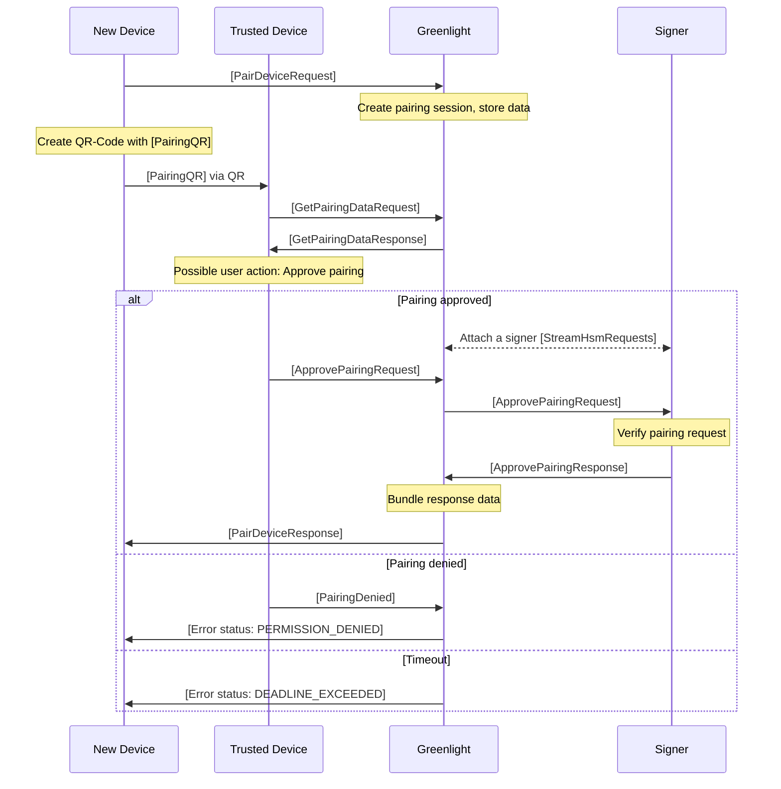

# Signer-less Device Pairing

Greenlight achieves the non-custodial operation of a Lightning Node in the cloud by decoupling the cryptographic keys from the node operations. Greenlight services handle the infrastructural complexities, while the cryptographic keys used to sign transactions stay on the user's device, ensuring users maintain full control over their funds.

To extend accessibility and flexibility, Greenlight introduced a **Pairing Process** enhanced with **runes policy restrictions** for signer-less devices.

## Signer-Less Device

A common way to set up Greenlight is to bundle the **client** and the **signer**, since the client needs access to the signer during node registration to prove ownership of the private key that belongs to the node ID under which they want to register a node.

!!! note "Figure 1: Common device setup with full signer access."
    ```mermaid
    block-beta
      block:UD
    columns 1
    T1["User Device"]
    Client["<b>Client</b>\nCredentials (C)"]
    Signer["<b>Signer</b>\nSecret (S)"]
      end

      space
      block:GL
    columns 1
    T2["Greenlight"]
    Node["Lightning Node"]
    space
      end

      space
      Network

      Node --> Client
      Client-- "Commands" -->Node
      Signer --> Node
      Node-- "Sig Requests" -->Signer
      Node --> Network
      Network --> Node

      classDef signer fill:#ffc800,stroke:#333;
      classDef client fill:#a6e031,stroke:#333;
      classDef headline fill:none,stroke:none;

      class T1 headline
      class T2 headline
      class Signer signer
      class Client client
      class Node client
    ```

However, there are situations where a user may not want a new device to have full access to the signer. In such cases, the user might have concerns about exposing the private key on a new or untrusted device. Also, the developer of an application that utilizes Greenlight might only need restricted access to the node and does not want to take the risks or comply with regulations that come with managing private keys on behalf of a user. To mitigate these risks, the user can keep the signer on a trusted device and allow a new device to interact with it remotely via Greenlight. This approach ensures that the private key remains protected while still allowing the client to perform necessary operations.

A device that does not have direct access to a signer is called **signer-less**.

!!! note "Figure 2: Setup with a signer-less device that does not have direct access to a signer."
    ```mermaid
    block-beta
      block:DS
       columns 1
       block:UD
    columns 1
    T1["User Device"]
    Client1["<b>Client</b>\nCredentials (C)"]
    Signer["<b>Signer</b>\nSecret (S)"]
       end
       block
    columns 1
    T3["Signer-Less Device"]
    Client2["<b>Client</b>\nCredentials (C<sup>&#8224;</sup>)"]
    space
       end
      end

      space
      block:GL
    columns 1
    T4["Greenlight"]
    Node["Lightning Node"]
    space
      end
      space
      Network

      Node --> Client1
      Client1-- "Commands" -->Node
      Signer --> Node
      Node-- "Sig Requests" -->Signer
      Node --> Client2
      Client2-- "Commands" -->Node
      Node --> Network
      Network --> Node

      classDef signer fill:#ffc800,stroke:#333;
      classDef client fill:#a6e031,stroke:#333;
      classDef headline fill:none,stroke:none;

      class Signer signer
      class Client1 client
      class Client2 client
      class Node client
      class T1 headline
      class T3 headline
      class T4 headline
      class DS headline
    ```

## Pairing Process

When integrating new client devices that do not have direct access to a signer, Greenlight employs a pairing process to securely associate these devices with the node. A signer-less device can request access to a node with a certain set of restrictions.

### Pairing Process Overview

The pairing process involves the following key steps:

1. **Initiate Pairing Request**: The new device sends a pairing request to Greenlight.
2. **Share the Pairing Request**: The new device presents a QR code to an already trusted device.
3. **Attestation by Trusted Device**: An already trusted device approves the pairing request.
4. **Create Credentials**: A connected signer provides a restricted rune bound to the new device.
5. **Completion**: Greenlight returns the bundled credentials to the new device, which is now paired and can interact with the node according to the restrictions set in the rune.

### Detailed Process



#### 1. Initiate Pairing Request

The new device, which lacks access to the signer's private key, initiates the pairing process by sending a `PairDeviceRequest` to the Greenlight service. This request typically includes:

- **Device Identifier**: The public TLS key of the new device that matches the signature for the certificate signing request (CSR).
- **Certificate Signing Request**: A certificate signing request for an X.509 TLS certificate to authenticate against the Greenlight services.
- **Device Name**: A descriptive name for the device that will be set in the subject CN field of the certificate.
- **Device Description**: A human-readable description about the purpose of the device that is meant to be presented to the user during the pairing process.
- **Restrictions**: A set of restrictions that will be used to construct the rune for the device, which will provide authorization to issue node commands.

### 2. Share the Pairing Request

To get attestation from an already known device, the new device needs to share some data with a trusted device. This is typically done by presenting a QR code that the trusted device can scan. The data that has to be shared is in the following format:

- **QR Data**: `gl-pairing:<public_key_of_device>`

### 3. Attestation by Trusted Device

The trusted device retrieves the pairing session data from Greenlight via a `GetPairingDataRequest`. The trusted device validates the returned data and can optionally present it to the user to ask for permission. After that, the trusted device sends an `ApprovePairingRequest` message via Greenlight to an attached signer. This message includes:

- **Pairing Session Identifier**: The new device's public key as returned by the `GetPairingDataResponse` message.
- **Timestamp**: The time at which the pairing request was attestated.
- **Device Name**: The device name as returned by the `GetPairingDataResponse` message.
- **Restrictions**: A set of restrictions used by the signer to construct the rune for the new device.
- **Signature**: A signature of the above fields for the signer to check for data integrity.
- **Public Key**: The public key corresponding to the signature in this message.
- **Rune**: The rune of the trusted device. The public key field of the rune has to match the public key field above.

### 4. Create Credentials

#### Signer Provides Rune

The signer, upon receiving the `ApprovePairingRequest`, checks the data integrity and verifies that the trusted device is allowed to attest pairing requests. After that, it generates a **rune**, which is an authorization token defining the restrictions for the new device. The rune:

- **Is Cryptographically Signed**: Ensures authenticity and integrity.
- **Contains Restrictions**: Specifies what actions the new device is allowed to perform.

#### Greenlight Supplies Credentials

Greenlight then delivers the necessary credentials to the new device. This includes:

- **TLS Certificate**: Used to authenticate the device with Greenlight and for secure communication between services.
- **Rune**: Used to authenticate commands with the signer.

### 5. Completion of Pairing

With the rune and credentials received:

- **Secure Connection Established**: The new device can securely connect to the node via Greenlight.
- **Access Granted**: The device can perform operations as permitted by the rune and credentials.
- **Device Registered**: Greenlight and the signer recognize the new device as an authorized client.

## Security Considerations

- **Controlled Access**: Only devices approved by a trusted device with signer access can pair, preventing unauthorized access.
- **Private Key Protection**: The signer's private key remains secure and is not exposed to new devices.
- **Granular Permissions**: Runes allow for fine-grained permission control, limiting the scope of what new devices can do.

## Use Cases

- **Multi-Device Management**: Users can manage their node from multiple devices without exposing the private key to each device.
- **Delegated Access**: Specific devices can be given limited permissions, useful for roles like monitoring, auditing, or invoice creation.
